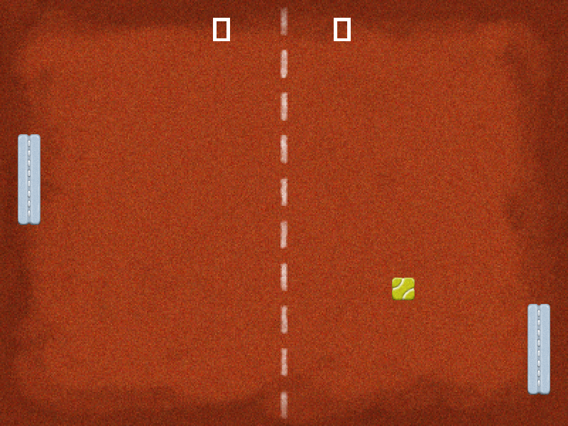

# Pong In Taylor


Pong made in the [Taylor game framework](https://github.com/HellRok/Taylor).
It features a really simple AI to play with and the classic Pong mechanics.
The motivation behind this project was to get my feet wet with taylor 
and ruby for game development.

<p align="center">
  
</p>

## Play it

You can get the latest release from [here](https://github.com/Chadowo/pong-taylor/releases).

## Development

First clone the project:

```console
git clone https://github.com/Chadowo/pong-taylor.git
```

and [download Taylor for your platform](https://taylor.oequacki.com/#downloads) (you can grab it from the [releases on github](https://github.com/HellRok/Taylor/releases) too).
Once that's done you should move the taylor executable to the directory where you cloned the project,
then it should be as easy as running the taylor executable to play the game.

To export the game, run `./taylor export` (or `rake export`), make sure you have [Docker](https://www.docker.com/)
installed and working.

## Assets

Credits goes to [domsson](https://opengameart.org/users/domsson) on
opengameart for the pong graphics.

see [CREDITS.txt](assets/CREDITS.txt).

## License

This project is licensed under the [MIT](LICENSE) license.
